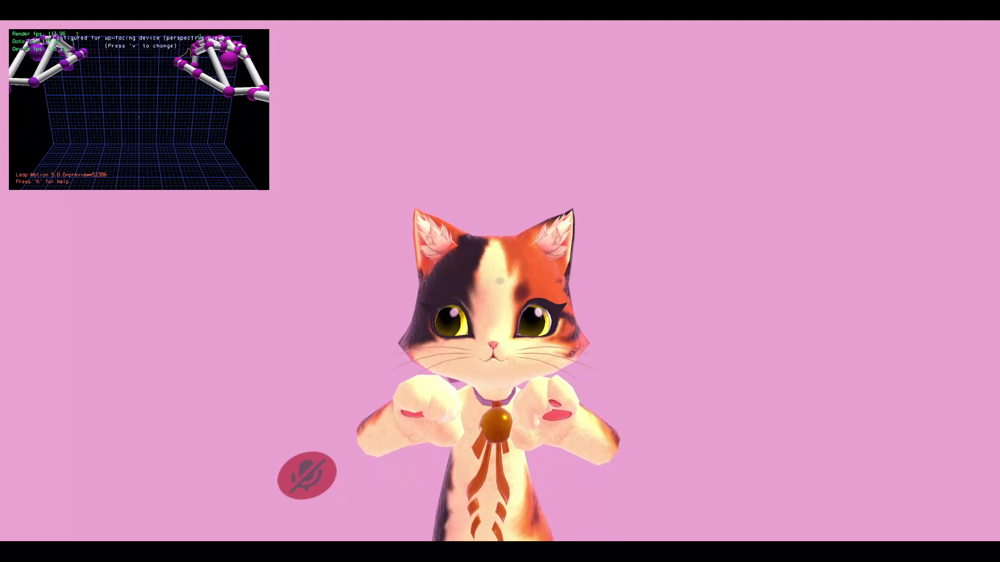

# Leap Motion Extension
This mod allows you to use your Leap Motion controller for hands and fingers visual tracking.

# Installation
* Get [latest release](../../releases/latest).
* Extract archive to VRChat folder.

# Usage
Available settings im mods settings menu:
* **Enable Leap Motion extension:** enable/disable extension.
* **Enable HMD mode for Leap Motion:** force HMD mode for Leap Motion controller.
* **Send SDK3 parameters:** send Avatars 3.0 parameters. This is useful fallback for VR mode usage because there is no found way to override fingers states with active VR controllers on remote players side. In this case avatar has to have specific parameters:
  * `_FingerValue(0-9)`: float value, represents value of finger squeeze in range of 0.0 to 1.0. Indexes are:
    * 0 - Left thumb
    * 1 - Left index
    * 2 - Left middle
    * 3 - Left ring
    * 4 - Left pinky
    * 5 - Right thumb
    * 6 - Right index
    * 7 - Right middle
    * 8 - Right ring
    * 9 - Right pinky
  * `_HandPresent(0-1)`: boolean value, represents detection of hand. Indexes are:
    * 0 - Left hand
    * 1 - Right hand
* **Root point:** transformation root for hands position: 0 - player itself, 1 - player's head.
* **RootOffsetY/RootOffsetZ:** transformation root offset. Values are representing offset for avatar with height 1.0. After applied offsets transformation scales based on current avatar height.

# Notes
Usage of mods breaks ToS of VRChat and can lead to ban. Use at your own risk.
